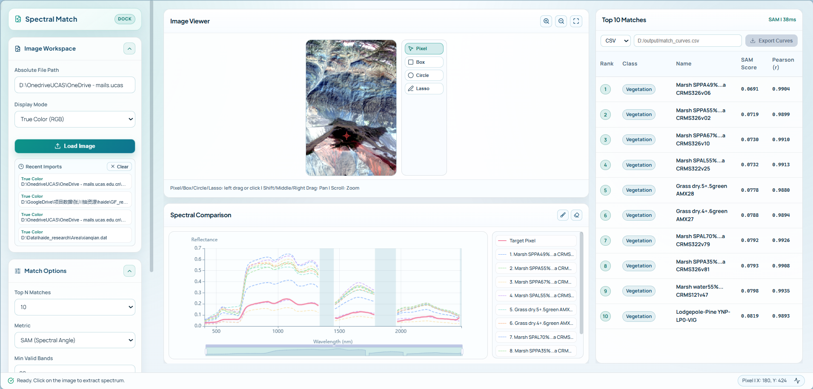

# Spectral Match

`Spectral Match` 是一个本地运行的高光谱光谱匹配工具。前端基于 `React + Vite`，后端基于 `FastAPI`。项目支持加载本地高光谱影像，进行像元/区域光谱提取，与本地光谱库做匹配，并导出结果。



## 目录说明

```text
Spectral_Match/
├─ main.py                         # 一键启动
├─ backend/
│  ├─ app/                         # FastAPI 业务代码
│  ├─ scripts/                     # 光谱库编译与缓存预构建脚本
│  ├─ data/
│  │  ├─ cache/                    # 运行时签名缓存
│  │  ├─ library/                  # 本地光谱库文件
│  │  └─ previews/                 # 预览图缓存
│  ├─ requirements.txt
│  └─ pyproject.toml
├─ frontend/
   ├─ src/                         # React 前端源码
   ├─ package.json
   └─ package-lock.json
```

## 环境准备

### 后端

- Python `3.11+`
- 依赖安装方式由使用者自行处理，推荐单独虚拟环境

PowerShell 示例：

```powershell
cd .\backend
python -m venv .venv
.\.venv\Scripts\Activate.ps1
pip install -r .\requirements.txt
```

### 前端

- Node.js + npm

PowerShell 示例：

```powershell
cd .\frontend
npm install
```

## 数据准备

项目运行时读取的是后端本地生成文件（usgs标准光谱库，包含2000+条光谱）：

- `backend/data/library/usgs_master.h5`
- `backend/data/library/usgs_meta.db`


## 启动方式

```powershell
python .\main.py
```